# Go2W 室内 3D 定位导航避障 — 设计

> 日期：2026-08-17  
> 状态：brainstorming 已收敛；待用户审阅  
> 路径：`/media/lenovo/disk/planner_ws/docs/superpowers/specs/`

---

## §1. 背景与目标

### 1.1 项目目标

在宇树四足机器狗 **Go2W** 实机上，部署一套室内可用的完整 3D 导航栈，包含：**建图 + 定位 + 全局路径规划 + 局部避障**。当前阶段交付目标：

1. 设计整体架构、主入口、建图/定位切换、RViz 可视化、目标点设置（为全局路径规划）
2. 确定每个模块的输入输出数据、Topic 名称、消息类型
3. 每个模块的算法选型

下一阶段：按 **建图 → 定位 → 全局路径规划 → 局部路径规划** 步骤各模块逐个开发，并跑通。

### 1.2 现状说明

- 当前对话地址：`/media/lenovo/disk/planner_ws/`
- git 跟踪仓地址：`/media/lenovo/disk/planner_ws/src/Nav3D/`
- 现有 LIO 模块来源（fork，未迁移）：`Ref_proj_tmp/Elevator-LIO/`
- 数据：`/media/lenovo/disk/planner_ws/data-rosbag2/Campus3`（含电梯段，截掉末段使用；后续替换为不含电梯版本）

### 1.3 开发说明

- `Nav3D/driver`：硬件驱动（当前只有 `livox_ros_driver2`，go2w 驱动待加入）
- `Nav3D/src`：每个模块，命名如 `lio`, `global_planner`, `local_planner`, `map_loader`, `scan_context_loop`, `goal_marker_server`
- `Nav3D/bringup`：顶层 launch + 统一 YAML 配置
- 构建：在 `planner_ws/` 下 `colcon build --cmake-args -DHUMBLE_ROS=humble`，`build/install` 在 workspace 根
- `planner_ws/Ref_proj_tmp`：开源参考仓（不进入 git）
- git 忽略 `build`, `install`, `log`, `.superpowers`, `Ref_proj_tmp`

---

## §2. 上游许可证聚合

| 上游包 | 许可证 | 我们怎么用 |
|---|---|---|
| **Elevator-LIO** | GPL-2.0-or-later | fork + patch（仅 `#define` frame_id 重命名）+ 重构目录（topic launch remap） |
| **livox_ros_driver2** | 商业 + 部分 MIT | fork + 重构目录，零代码修改 |
| **SCAN-Planner** | Apache-2.0 | fork + patch（仅 yaml topic 字段）+ 重构目录 |
| **FAST_LIO_SLAM (SC-PGO)** | GPL-2（待核精确版本） | **只取 `SC-PGO/src/scancontext/` 算法核心**，独立 ROS 2 包 `scan_context_loop`；保留原 license 头 |
| **OctoPlanner3D / jie_3d_nav** | 见上游 | **仅模仿算法，代码不复制**，避免许可证传染（本期仅定接口，不选型） |
| **jie_octomap** | 见上游 | fork + 重构目录，只保留地图导入工具 |
| **KISS-ICP** | MIT | `pip install kiss-icp` 集成到 `lio_localization` 作为 fine localization |

---

## §3. 架构总览与组件

### 3.1 系统组件

| 组件 | 节点 | 角色 | 输入 | 输出 |
|---|---|---|---|---|
| **sensor** | `livox_ros_driver2` / GazeboQuadbot livox_plugin | 物理或仿真 mid360 | — | `/livox/lidar` (CustomMsg), `/livox/imu` (Imu) |
| **mapping** | `lio_mapping` | 跑场景生成 PCD 地图 | `/livox/{lidar,imu}` | `/lio/mapping/*`（原 `/LIO/*` launch remap 后），`save_map` 服务 |
| **map_loader** | `map_loader_node` | 服务化加载 PCD → OctoMap + 触发 scan_context 索引生成 | service | `/map_loader/octomap` (transient_local), `/map_loader/scan_context_index` (transient_local) |
| **localization** | `lio_localization` | scan_context 粗定位 + KISS-ICP 精定位 + IESKF 在线 + 回环 | `/livox/{lidar,imu}`, `/map_loader/scan_context_index`, map.pcd, `/scan_context_loop/loop_closure`, `/scan_context_loop/gps_factor` (可选) | `/lio/localization/{odom,score,odom_imu,odom_body}`, TF `map → odom` |
| **scan_context_loop** | `scan_context_loop_node` | Scan-Context 回环检测 + GTSAM 位姿图（**4-5 变量滑窗**避免全套位姿图） + **GPS 因子（可选，runtime disabled）** | `/lio/mapping/odom_body`, `/lio/mapping/clouds_lidar`, `/scan_context_loop/gps_odom` (可选) | `/scan_context_loop/loop_closure`, `/lio/localization/odom` (修正后) |
| **goal_marker** | `goal_marker_server` | InteractiveMarker 3D 点 + 朝向 | RViz GUI 操作 | `/goal_pose` (PoseStamped, frame=map) |
| **global_planner** | `global_planner` | OctoMap A* + path smoothing | `/map_loader/octomap`, `/goal_pose`, `/lio/localization/odom` | `/global_planner/path` (Path) |
| **local_planner** | `local_planner` (SCAN-Planner) | 局部滑窗避障 + 追踪全局路径 | `/global_planner/path`, `/lio/localization/odom`, `/map_loader/octomap` | `/local_planner/cmd_vel` (Twist) |
| **bringup** | `bringup_nav3d.launch.py` | 编排 + 全 Node remap 集中 | — | 启动所有节点 + rviz2 |

### 3.2 启动模式（仅 bag replay 跑测试）

```bash
# bag replay（本期唯一测试入口）
ros2 launch bringup bringup_nav3d.launch.py \
    mode:=bag scene:=campus3 \
    bag_path:=/media/lenovo/disk/planner_ws/data-rosbag2/Campus3 \
    map:=/media/lenovo/disk/planner_ws/maps/campus3.pcd \
    use_localization:=false  # mapping 阶段
```

> **测试数据约束**：本期**禁用 GazeboQuadbot 仿真**（其 IMU/lidar 频率太低，与 bag 节奏不匹配），**禁用实机自录 bag**（CustomMsg 数据量大导致 lidar 丢包）。唯一测试源 = `data-rosbag2/` 开源预录 bag。Campus3 含电梯段，bag 播放时**截掉末段**；`elevator.enable=false` 在 yaml 中固化。

---

## §4. 数据流图

```
 ┌──────────────┐
 │ sensor (mid360)│
 └──────┬───────┘
        │ /livox/{lidar,imu}
        ├──────────────────────────────┐
        ▼                              ▼
 ┌─────────────────┐         ┌──────────────────────┐
 │   lio_mapping    │         │  scan_context_loop_node│
 │ (mapping 阶段) │         │ (订阅 mapping 输出)  │
 └────┬────────────┘         └────┬─────────────────┘
      │ save_map srv             │ loop_closure
      ▼                           ▼
 maps/<scene>.pcd         ┌────────────────────────┐
      │                   │   lio_localization     │
      │ load              │ (scan_context 粗定位   │
      ▼                   │  + KISS-ICP 精定位     │
 ┌──────────────────┐     │  + IESKF + 回环)      │
 │ map_loader_node  │ ──► └─────┬────────────────────┘
 │ PCD→OctoMap      │              │ /lio/localization/odom
 │ + scan_context   │              │ TF map→odom (带回环)
 └────┬─────────────┘              │
      │ /map_loader/octomap        │
      │ /map_loader/scan_context_index
      ▼                            │
 ┌──────────────────┐              │
 │ global_planner   │ ◀────────────┤
 │ OctoMap A*      │
 └────┬─────────────┘
      │ /global_planner/path
      ▼
 ┌──────────────────┐              ▲
 │ local_planner    │ ◀────────────┘
 │ (SCAN-Planner)   │
 └────┬─────────────┘
      │ /local_planner/cmd_vel
      ▼  bringup remap → /cmd_vel
 ┌──────────────────┐
 │ driver (unitree / gazebo) │
 └──────────────────┘
```

---

## §5. 状态机

```dot
digraph FSM {
    rankdir=LR;
    node [shape=ellipse];
    IDLE        [label="IDLE\n(等启动参数)"];
    MAPPING     [label="MAPPING\nlio_mapping 跑场景"];
    SAVING      [label="SAVING\nsave_map 服务触发"];
    LOCALIZING  [label="LOCALIZING\nscan_context 粗定位\n+ KISS-ICP 精对准"];
    LOST        [label="LOST\nscore<阈值"];
    RE_LOC      [label="RE_LOC\n重试粗定位或 /initialpose"];

    IDLE -> MAPPING        [label="mode=mapping"];
    MAPPING -> SAVING      [label="save_map OK"];
    SAVING -> LOCALIZING   [label="load_map OK"];
    LOCALIZING -> LOST     [label="score<th"];
    LOST -> RE_LOC         [label="自动重试"];
    RE_LOC -> LOCALIZING   [label="成功"];
    RE_LOC -> LOST         [label="失败 3 次"];
}
```



---

## §6. TF 树（root = `map`）

```
map ──(dynamic, 含回环修正)──▶ odom ──(dynamic, LIO 输出)──▶ base_link ──(static, mid360 外参)──▶ lidar_frame
```

**frame_id 命名约定**（C++ `#define` patch 重命名 LIO 内部字面量）：

| LIO 内部 frame_id | 对外 frame_id |
|---|---|
| `world` | `odom` |
| `IMU` | `base_link` |
| `body` | `base_link` |
| `lidar` | `lidar_frame` |

**TF 发布责任**：

| 边 | 发布者 | 类型 | 备注 |
|---|---|---|---|
| `map → odom` | `lio_mapping`（恒等）/ `lio_localization`（动态+回环） | 动态 | mapping 阶段由 lio_mapping 发恒等 TF（首帧为原点） |
| `odom → base_link` | LIO（C++ patch 后） | 动态 | mapping/localization 都发布 |
| `base_link → lidar_frame` | bringup 静态 | 静态 | mid360_R_body / lidar_T_body：sim R_y(0.4) t=[-0.28, 0, -0.02]；real R_y(0.314) t=[0.18, 0, 0.13]；Campus3 R_z(90°) t=[-0.2, 0, -0.15] |
| `base_link → livox_frame`（legacy alias） | bringup 静态 | 静态 | 兼容 Campus3 bag replay 脚本（过渡保留） |

---

## §7. Topic 表

| Topic | 消息类型 | 发布者 | 订阅者 | QoS（推荐） | 频率 | frame_id |
|---|---|---|---|---|---|---|
| `/livox/lidar` | `livox_ros_driver2/CustomMsg` | sensor | `lio_mapping`, `lio_localization` | best_effort, depth=10, volatile | ~50 Hz | `lidar_frame` |
| `/livox/imu` | `sensor_msgs/Imu` | sensor | `lio_mapping`, `lio_localization` | best_effort, depth=200, volatile | ~111/200 Hz | `base_link` |
| `/lio/mapping/odom_imu` | `nav_msgs/Odometry` | `lio_mapping` | RViz, debug | reliable, depth=10, volatile | 200 Hz | `odom → base_link` |
| `/lio/mapping/odom_body` | `nav_msgs/Odometry` | `lio_mapping` | `scan_context_loop_node`, RViz | reliable, depth=10, volatile | 50 Hz | `odom → base_link` |
| `/lio/mapping/clouds_lidar` | `sensor_msgs/PointCloud2` | `lio_mapping` | `scan_context_loop_node`, RViz | best_effort, depth=5, volatile | 50 Hz | `base_link` |
| `/lio/mapping/global_map` | `sensor_msgs/PointCloud2` | `lio_mapping` | RViz, `map_loader_node` | reliable, depth=2, transient_local | 5 Hz | `odom` (mapping 阶段无全局系) |
| `/lio/mapping/ikdtree` | `sensor_msgs/PointCloud2` | `lio_mapping` | RViz | reliable, depth=1, transient_local | on_change | `odom` |
| `/lio/mapping/in_elevator` | `std_msgs/Bool` | `lio_mapping` | bringup, RViz | reliable, depth=1, transient_local | on_change | — |
| `/lio/mapping/set_elevator_flag` | `std_msgs/Bool` | bringup | `lio_mapping` | reliable, depth=1, volatile | manual | — |
| `/map_loader/octomap` | `octomap_msgs/Octomap` | `map_loader_node` | `global_planner`, `local_planner` | reliable, depth=1, transient_local | on_load | `map` |
| `/map_loader/scan_context_index` | `std_msgs/String` (path) | `map_loader_node` | `lio_localization` | reliable, depth=1, transient_local | on_load | — |
| `/scan_context_loop/loop_closure` | `geometry_msgs/PoseWithCovarianceStamped` | `scan_context_loop_node` | `lio_localization` | reliable, depth=1, volatile | on_event | `map` |
| `/scan_context_loop/gps_odom` | `nav_msgs/Odometry` | （外接 GPS 节点，**本期禁用**） | `scan_context_loop_node` | reliable, depth=10, volatile | 1 Hz | `map` |
| `/lio/localization/odom` | `nav_msgs/Odometry` | `lio_localization` | RViz, `global_planner`, `local_planner` | reliable, depth=10, volatile | 50 Hz | `map → odom` |
| `/lio/localization/score` | `std_msgs/Float32` | `lio_localization` | bringup monitor | reliable, depth=10, volatile | 10 Hz | — |
| `/initialpose` | `geometry_msgs/PoseWithCovarianceStamped` | RViz 2D Pose Estimate | `lio_localization` (fallback) | reliable, depth=1, volatile | manual | `map` |
| `/goal_pose` | `geometry_msgs/PoseStamped` | `goal_marker_server` | `global_planner` | reliable, depth=1, volatile | manual | `map` |
| `/global_planner/path` | `nav_msgs/Path` | `global_planner` | `local_planner`, RViz | reliable, depth=1, transient_local | on_goal + 1 Hz heartbeat | `map` |
| `/local_planner/cmd_vel` | `geometry_msgs/Twist` | `local_planner` | RViz (twist marker) | reliable, depth=10, volatile | 20 Hz | — |
| `/cmd_vel` | `geometry_msgs/Twist` | local_planner 经 launch remap | driver | reliable, depth=10, volatile | 20 Hz | — |
| `/tf`, `/tf_static` | `tf2_msgs/TFMessage` | 各 TF 发布者 | `tf2_ros` | reliable, depth=100, volatile | — | — |

**命名空间总览**：

```
/livox/{lidar,imu}                          ← 生态标准
/lio/mapping/{odom_imu,odom_body,clouds_lidar,global_map,ikdtree,in_elevator,set_elevator_flag}
/lio/localization/{odom,score,odom_imu,odom_body}
/map_loader/{octomap,scan_context_index}
/scan_context_loop/{loop_closure,gps_odom}
/global_planner/path
/local_planner/cmd_vel
/goal_pose, /initialpose, /cmd_vel           ← 生态标准
/tf, /tf_static                             ← ROS 特殊
```

---

## §8. 上游 fork 修改边界（合约）

| Fork | 修改边界 | 估算 |
|---|---|---|
| **Elevator-LIO** | 仅 `#define FRAME_*` 字面量替换（world→odom / IMU→base_link / body→base_link / lidar→lidar_frame）；yaml 加 `frame_*_id` 字段 | ~10 行 C++ |
| **SCAN-Planner** | 仅 yaml 字段 `input_topic` / `output_topic` | ~3 行 |
| **livox_ros_driver2** | **零修改** | 0 |
| **FAST_LIO_SLAM (SC-PGO)** | 仅 port `SC-PGO/src/scancontext/` 算法核心到新 ROS 2 包 `scan_context_loop`；保留原 license 头；保留 GPS 因子代码路径（runtime disabled） | ~10 个 .h/.cpp |
| **global_planner** (jie_3d_nav / OctoPlanner3D) | 本期未定，留接口 | 待下一 spec |
| **map_loader_node** | 自实现，无 fork 依赖 | 0 |
| **KISS-ICP** | `pip install kiss-icp` + rosdep 注册；不修改其代码 | 0 |

> **合约**：上游算法逻辑、IESKF、降采样、OctoMap A* 等一律不动。patch 仅在 **frame_id 字符串、topic 名字段、boundary adapter** 层。

---

## §9. 错误处理与回退

| 失败模式 | 检测信号 | 回退动作 |
|---|---|---|
| **LIO 跟丢** | `/lio/localization/score` 持续 < 0.3 或 odom NaN | 报警；触发 `/initialpose`；3 次失败停 `/cmd_vel` |
| **lidar/imu 数据断流** | topic 监听 timeout > 0.5s | 报警；冻结 odom；超 2s 全栈 STOP |
| **map_loader_node 加载失败** | service 失败 / PCD 不存在 | 报警停 lio_localization；提示先跑 mapping |
| **scan_context 粗定位失败** | score < 0.1 | 自动触发 `/initialpose` fallback |
| **global_planner A* 超时** | 超 5s 或无可行路径 | 保留上一路径；报警、提示调整目标 |
| **local_planner 偏离全局路径** | 距 path > 1m 持续 3s | 触发 global_planner 用当前位姿 + 原 goal 重规划 |
| **driver / `/cmd_vel` 故障** | 消费端超时 1s | 全栈 STOP（急停） |
| **TF 缺失** | tf2 lookupException | 启动时强制 TF 自检（map→odom, odom→base_link, base_link→lidar_frame 三边必须存在）否则拒绝启动 |

**全栈 STOP 协议**：bringup 维护 `/system/heartbeat`（每个 Nav3D 节点每秒 1 次）；任意核心节点（lio_mapping / lio_localization / global_planner / local_planner）超 3s 无心跳 → bringup 触发 `/cmd_vel` 急停 + RViz 红字。

---

## §10. 测试策略（仅 bag replay）

| 层级 | 场景 | 数据源 | 通过准则 |
|---|---|---|---|
| 单元 | 模拟 IMU 100Hz + lidar 50Hz → lio_mapping 1 min | mock | odom vs GT < 0.1m |
| 集成 | bringup + Campus3 bag loop + lio_mapping | `data-rosbag2/Campus3` | save_map 产 PCD > 10MB |
| 集成 | bringup + Campus3 bag loop + lio_localization | 同上 | score > 0.7 持续，odom 误差 < 0.5m |
| 集成 | map_loader_node 加载 PCD | PCD 输出 | OctoMap 体素 > 1000，scan_context idx 写入 |
| **E2E** | bag 闭环：lio_mapping → save → map_loader → lio_localization + SC + KISS-ICP + global_planner + local_planner | Campus3（截掉电梯段） | RViz 全链路可视化，cmd_vel 流持续 |
| 异常 | bag 中人为设 score < 0.3（错位启动） | Campus3 | 触发 `/initialpose` fallback → 自动恢复 |
| 异常 | 杀掉 `ros2 bag play` | Campus3 | 全栈 STOP（< 0.5s） |

**禁用项**：
- ❌ GazeboQuadbot 仿真（IMU/lidar 频率太低，与 bag 节奏不匹配）
- ❌ 实机自录 bag（CustomMsg 数据量大，lidar 丢包）
- ✅ 仅 `data-rosbag2/` 开源预录 bag

---

## §11. 风险与开放问题

| 风险 | 影响 | 缓解 |
|---|---|---|
| **Campus3 bag 含电梯段** | mapping 阶段 elevator flag 误触发 | bag 截末段播放；`elevator.enable=false` 固化 |
| **后续替换 bag 为不含电梯版本** | yaml 无需改；只需换 bag 路径 | launch arg `bag_path:=` 参数化 |
| **bag 路径硬编码** | 多机不可移植 | launch arg 参数化 |
| **ROS_DOMAIN_ID** | 多机 DDS 隔离 | 默认 18 |
| RViz config 三档 mode 维护 | 配置混乱 | `nav3d_bag.rviz`（主）/ `nav3d_sim.rviz` / `nav3d_real.rviz`（保留位） |
| LIO C++ `#define` patch 与上游 drift | 长期维护 | 开 PR 推上游；README 声明 patch 范围 |
| livox_ros_driver2 商用 + MIT 协议 | 合规 | §2 已记 |
| **`global_planner` 算法未定**（jie_3d_nav vs OctoPlanner3D） | 路径规划接口未确定 | 仅定 `/global_planner/path` 接口，下一 spec 选算法 |
| **GPS 因子本期禁用但保留接口** | 半开放园区未来用 | `/scan_context_loop/gps_odom` topic 保留，`gps_factor_enabled:=false` launch arg |
| **Campus3 bag 拐弯 IKDTree > 10ms 警告** | mapping 卡顿 | 已 `global_map_pub_enable=true` + RViz Decay=999；根治需 IESKF 调参 |

---

## §12. Scan-Context fork 选型决策

**决策：选 FAST_LIO_SLAM (gisbi-kim)，只取 `SC-PGO/src/scancontext/` 算法核心，独立 ROS 2 包 `scan_context_loop` 包装。**

理由：
1. **架构匹配**：SC-PGO 独立节点订阅 mapping 输出，与"lio_localization + 外部回环服务"模式天然对齐
2. **KISS**：只 port 一个 C++ 算法目录（~10 个 .h/.cpp），不重写 back-end
3. **GPS 因子保留**：从 FAST_LIO_SLAM 取出 SC-PGO 代码时**保留 GPS 因子代码路径**，但通过 launch arg `gps_factor_enabled:=false` 默认禁用；未来半开放园区场景启用
4. **patch 可控**：核心算法 license 头保留，Nav3D wrapper 用 MIT

---

## §13. 任务分解与里程碑

| # | 任务 | 依赖 |
|---|---|---|
| 1 | 上游 patch：Elevator-LIO `#define` frame_id；SCAN-Planner topic yaml | — |
| 2 | `bringup_nav3d.launch.py` 重构：mode:=sim/real/**bag** 三档；全 Node remap 集中表；`bag_path:=` 参数化 | 1 |
| 3 | `lio_mapping` 节点：复用 Elevator-LIO + frame_id patch + yaml `elevator.enable=false` | 1 |
| 4 | `scan_context_loop` ROS 2 包：license 核 `FAST_LIO_SLAM/SC-PGO/src/scancontext/`；fork 保留原 license 头；保留 GPS 因子代码路径 | — |
| 5 | KISS-ICP fine localization 集成（`pip install kiss-icp` + rosdep） | — |
| 6 | `lio_localization` 节点整合：scan_context 粗定位 → KISS-ICP 精定位 → IESKF → 回环（接收 `/scan_context_loop/loop_closure`） → 输出 `/lio/localization/{odom,score,...}` + TF `map→odom` | 4, 5 |
| 7 | `map_loader_node`：服务化加载 PCD → OctoMap (transient_local) + scan_context_index (transient_local) | 3 |
| 8 | `goal_marker_server`：InteractiveMarker 3D Pose server | — |
| 9 | `global_planner` 接口 + 算法（下一 spec） | — |
| 10 | `local_planner` 集成：SCAN-Planner fork 接 `/global_planner/path`，输出 `/local_planner/cmd_vel`；bringup 在 driver 节点 remap → `/cmd_vel` | 1 |
| 11 | **bag replay E2E 测试**：Campus3（截掉电梯段）→ 全闭环 | 2, 7, 8, 10 |
| 12 | RViz config：`nav3d_bag.rviz`（主）/ `nav3d_sim.rviz` / `nav3d_real.rviz`（保留位） | 11 |
| 13 | 异常路径：STOP 协议 / LOST → `/initialpose` 自动恢复 | 11 |
| 14 | 实机部署：mode:=real + unitree + livox_ros_driver2（本期最后） | 11 |

**里程碑**：
- **M1**：任务 1-3 完成 → `lio_mapping` 在 bag 上跑通保存 PCD
- **M2**：任务 4-7 完成 → `lio_localization` 在 bag 上跑通 score > 0.7
- **M3**：任务 8-10 完成 → 端到端闭环跑通
- **M4**：任务 11-13 完成 → 异常路径 + 完整测试通过
- **M5**：任务 14 完成 → 实机部署

---

## §14. 开放问题（移交下一 spec）

1. `global_planner` 算法选型（jie_3d_nav vs OctoPlanner3D）—— 单独 spec
2. 后续替换 bag 为不含电梯版本时的迁移步骤
3. GPS 因子启用条件（半开放园区场景）
4. SC-PGO GTSAM 因子图滑窗大小（4-5 个变量）的实际调参